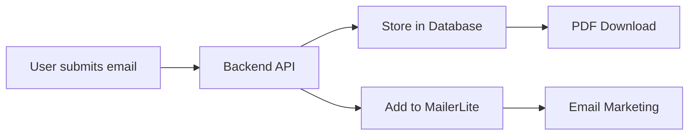

# 📧 MailerLite Integration Setup

This guide will help you set up MailerLite integration for your coaching site's lead magnet funnel.

## 🎯 What MailerLite Does

- **Automatically adds** email subscribers from your lead magnet
- **Enables email marketing** campaigns and follow-ups
- **Segments subscribers** with custom fields
- **Tracks engagement** and conversion metrics

## 🚀 Quick Setup

### 1. Get Your MailerLite API Key

1. **Sign up/Login** to MailerLite: https://www.mailerlite.com/
2. **Go to Integrations**: https://app.mailerlite.com/integrations/api
3. **Generate new token** and copy the API key

### 2. Configure Your Environment

**Option A: Run the setup script**
```bash
./setup-mailerlite.sh
```

**Option B: Manual setup**
```bash
# Copy the example file
cp .env.example .env

# Edit the .env file
nano .env

# Add your API key
MAILERLITE_API_KEY=your_actual_api_key_here
```

### 3. Test the Connection

```bash
cd backend
source venv/bin/activate
python test_mailerlite.py
```

### 4. Start Your Application

```bash
docker-compose up
```

## 🔧 Configuration Options

### Environment Variables

| Variable | Description | Default |
|----------|-------------|---------|
| `MAILERLITE_API_KEY` | Your MailerLite API token | None (required) |
| `DATABASE_URL` | Database connection string | `sqlite:///./coaching_site.db` |
| `NEXT_PUBLIC_SITE_URL` | Your site URL | `http://localhost:3000` |

### Custom Fields Added to MailerLite

When someone downloads your lead magnet, these fields are automatically added:

- `source`: "lead_magnet"
- `guide`: "5_theater_secrets"

## 📊 How It Works



### Lead Magnet Flow

1. **User submits email** on your website
2. **Backend stores email** in local database (always happens)
3. **Backend adds to MailerLite** in background (if configured)
4. **User gets PDF download** immediately
5. **You can follow up** with email campaigns

## 🎭 Fallback Behavior

**If MailerLite is not configured:**
- ✅ Emails are still stored in local database
- ✅ Users still get PDF downloads
- ✅ You can export emails later
- ❌ No automatic email marketing

**If MailerLite API fails:**
- ✅ System continues working normally
- ✅ Error is logged for debugging
- ✅ Emails are safely stored in database

## 🛠️ Troubleshooting

### Common Issues

**"API key not found"**
- Check your `.env` file exists
- Verify `MAILERLITE_API_KEY` is set
- Make sure no extra spaces around the key

**"MailerLite API error: 401"**
- Your API key is invalid
- Generate a new token in MailerLite
- Double-check you copied the full key

**"Connection timeout"**
- Check your internet connection
- MailerLite might be temporarily down
- System will continue working with local storage

### Debug Mode

Enable detailed logging by setting:
```bash
export DEBUG=true
```

## 📈 Analytics & Tracking

### Database Analytics

Your lead magnet downloads are tracked in the database:

```sql
SELECT 
    email,
    download_count,
    created_at,
    last_downloaded_at
FROM lead_magnet_downloads
ORDER BY created_at DESC;
```

### MailerLite Segmentation

Subscribers are automatically tagged with:
- **Source**: `lead_magnet`
- **Guide**: `5_theater_secrets`

Use these tags to create targeted campaigns!

## 🎉 Next Steps

1. **Create email sequences** in MailerLite
2. **Set up automation** for new subscribers
3. **Design welcome emails** with additional value
4. **Track conversion rates** and optimize

## 📞 Support

If you need help:
1. Check the troubleshooting section above
2. Run the test script: `python test_mailerlite.py`
3. Check logs: `docker-compose logs backend`

---

Your lead magnet funnel is now ready for professional email marketing! 🚀